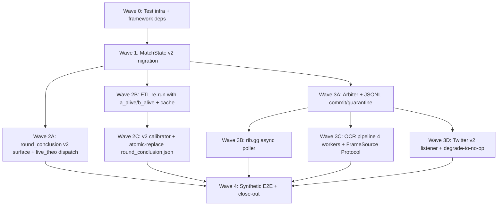

# Phase 03: Live Ingestion Layer — Research

**Researched:** 2026-05-06
**Domain:** Real-time multi-source ingestion, OCR pipeline, async polling, JSONL event log, post-plant rekey + ETL re-run
**Confidence:** HIGH (stack + patterns), MEDIUM (HUD coordinates + Twitter tier), LOW (precise tesseract small-ROI tuning — must be empirically validated)

## Summary

Phase 03 builds the ingestion plumbing that feeds `MatchState` from three live sources (rib.gg async poll, tesseract OCR on three primary HUD targets + post-plant alive widget, Twitter v2 streaming) through a 3-deque cross-source arbiter into a single in-memory state with a JSONL append log, while simultaneously rekeying `models/round_conclusion.json` to the v2 post-plant-only schema and re-running the Phase 2 ETL with `a_alive`/`b_alive` persisted. The phase is the largest by surface area in the project (~7-10 days), spans `src/state/`, `src/ingestion/`, `src/pricing/round_conclusion.py`, `src/pricing/live_theo.py`, and `scripts/probe_round_events.py`, and ships a synthetic E2E gate at `tests/ingestion/test_e2e.py`.

The 14 locked decisions (D-01..D-14) are exhaustive — research scope is purely *technical specifics* the planner needs to write executable plans: pinned library versions, tested API patterns, HUD coordinate baselines, GIL behavior, mock libraries, hypothesis strategies, and a wave-by-wave decomposition that respects the natural dependency graph (state migration → arbiter → OCR/poller/listener → live_theo dispatch wiring → calibration → E2E).

**Primary recommendation:** Use `pytesseract` (subprocess Popen pattern releases the GIL effectively but adds ~10-20ms fork overhead per call) + `asyncio.run_in_executor(ThreadPoolExecutor(max_workers=2))` per CONTEXT D-06 baseline; `pytesseract.image_to_string` calls subprocess.Popen for `tesseract` so concurrency works correctly, just budget for fork overhead. Use `tweepy.AsyncStreamingClient` for Twitter (smaller code, native asyncio, no transitive bloat from raw aiohttp + JSON streaming framing). Use `requests-cache==1.3.1` filesystem backend with a `threading.RLock` (the v2 ETL is single-threaded so this is no-op, but documented for future contributors). Use `aioresponses` to mock `aiohttp.ClientSession` in tests. Decompose into **5 waves**: Wave 0 (test infrastructure) → Wave 1 (state migration) → Wave 2 (round-conclusion v2 surface + live_theo dispatch + ETL re-run, parallelizable) → Wave 3 (ingestion sources + arbiter, parallelizable) → Wave 4 (E2E gate + close-out).

<user_constraints>
## User Constraints (from CONTEXT.md)

### Locked Decisions (D-01 through D-14)

**MatchState v2 dataclass shape (Area A):**

- **D-01: Single dataclass at `src/state/match_state.py`, ~19 fields.** Frozen+slots `MatchState` carries all 13 v2 dynamic fields PLUS the 6 Phase-1 static-per-match fields (`team_a, team_b, map_pool, map_side_orients, map_winners, pistol_winner_a`). The SPEC §1 enumeration lists only the 13 dynamic deltas — the Phase 1 static fields are required by `live_theo` (per Phase 1 D-17/D-18/D-19) and MUST remain on the v2 dataclass. Cut from v1: `numerical_diff, side, econ_bucket`. Splitting into MatchState + MatchContext at engine init was rejected.

- **D-02: Pure mutator + decoupled JSONL append.** `MatchState.with_update(**fields_changed) → MatchState` is pure: bumps `seq_id += 1` and `last_updated_ts = time.time()`, returns a new frozen instance, no I/O. The arbiter is the SOLE caller; after `with_update` returns, the arbiter appends a JSONL diff line AND atomically swaps the engine's reference. seq_id discipline guaranteed structurally (arbiter is sole writer of state AND sole appender of JSONL — single `commit(prev, next, source, event_type)` helper in `src/state/`).

- **D-03: JSONL line schema = diff-only with seq_id + six timestamps + provenance.** Per arbiter commit:
  ```json
  {"seq_id": 1042, "t_observed": 1730439612.123, "t_ingested": 1730439612.151,
   "t_arbited": 1730439612.198, "t_state_committed": 1730439612.201,
   "t_theo_computed": null, "t_quote_sent": null,
   "source": "ocr", "event_type": "bomb_plant",
   "fields_changed": {"bomb_planted": true, "attackers_alive": 4, "defenders_alive": 3, "time_left_s": 45.0}}
  ```
  Quarantined lines: `seq_id: null, quarantined: true, quarantine_reason: "...", fields_proposed: {...}`. Disk: ~200-400B/line × ~1500 events/match ≈ 0.3-0.6 MB/match; path `data/event_log/{match_id}.jsonl` (gitignored). Time discipline per SPEC: `t_observed` uses `time.time()`; the other five use `time.monotonic_ns()`.

**round_conclusion v2 surface + live_theo dispatch (Area B):**

- **D-04: Two methods + two Protocols on `RoundConclusionLookup`.** Add `between_round_p(side, map_name, round_idx) -> float` AND `post_plant_p(att, def_, time_bucket, side, map_name) -> float`. The v1 `lookup(...)` method is DELETED in the same atomic commit. The v1 `RoundConclusionFn` Protocol is DELETED. Two new Protocols `BetweenRoundFn`, `PostPlantFn` formalize the new surfaces. Phase 2's frozen-surface contract (D-15) is broken intentionally.

- **D-05: live_theo dispatches via top-level current-round override; DP recursion unchanged.** When `state.bomb_planted=True`, `_live_theo_impl` computes the CURRENT round's p separately via `post_plant_p`; future-round transitions ALWAYS use between-round semantics (no nested post-plant lookups in the recursion).

- **D-06: `models/round_conclusion.json` migrates atomic-replace at same path with `schema_version: 2` field.** New top-level `"schema_version": 2`; `from_json` HARD-FAILS on `schema_version != 2`. v2 JSON shape: `side_baseline`, `cells_minimal` (att|def), `cells_no_map` (att|def|side), `cells_no_time` (att|def|side|map), `cells_full` (att|def|time_bucket|side|map). `_Cell` shape (`n, p_hat, parent_p`) unchanged.

**REQ-7 ETL re-run (Area C):**

- **D-07: Full re-fetch of the same ~1000 series into a NEW `data/round_events_v2.sqlite`.** v1 db retained on disk. SPEC coverage target: ≥1000 distinct match_ids / ≥40k rounds. `synthesize_mid_round_states` augmented to persist `a_alive`/`b_alive` (already tracked at lines 268-269).

- **D-08: Cache via `requests-cache` filesystem backend at `data/ribgg_cache/`.** `CachedSession(cache_name='data/ribgg_cache', backend='filesystem', expire_after=NEVER)`. Phase 2 resilience patterns compose through CachedSession. ~5 GB on disk; `.gitignore` excludes `data/ribgg_cache/`.

- **D-09: Idempotency via per-series SQLite transactions; resume by `SELECT DISTINCT match_id`.** No separate progress file. Cache makes already-fetched calls instant (~1ms disk read).

- **D-10: `time_remaining_bucket` granularity = 5s; 9 buckets across the 45s post-plant timer.** `TIME_BUCKET_WIDTH_S = 5.0` constant. Cell estimate: ~3150 `cells_full` slots over ~25k post-plant samples ≈ 8 samples/cell average.

**Post-plant alive widget OCR (Area D):**

- **D-11: ROIs hand-calibrated from 2026 VCT VOD samples; pinned in `src/config/constants.py`.** Constants `POST_PLANT_ATTACKERS_ROI = (x1, y1, x2, y2)`, `POST_PLANT_DEFENDERS_ROI = (x1, y1, x2, y2)` plus `BROADCAST_TEMPLATE_VERSION: Final[str] = "vct-2026-international"`. **Per operator gate #1: use placeholder coords with a `# TODO(operator): recalibrate` comment.** Single-template assumption; multi-template is Phase 5 robustness work.

- **D-12: Hard-gated activation on `state.bomb_planted=True`; worker stops within 1 cycle of defuse/round-end.** OCR loop polls `state.bomb_planted` at every tick; activates at 250ms cadence (`OCR_POST_PLANT_ALIVE_CADENCE_MS`).

- **D-13: Read-failure → emit None → arbiter quarantines → state carries forward.** If a per-side digit doesn't parse to `{0,1,2,3,4,5}`, emit a `quarantined` event. Tesseract config: PSM 10 (single-character), `tessedit_char_whitelist=012345`, preprocessing = grayscale → Otsu threshold → 2× upscale. Constants pinned in `src/config/constants.py`.

- **D-14: `time_left_s` is COMPUTED, not OCR'd.** `time_left_s = max(0.0, POST_PLANT_TIMER_S - (time.time() - t_bomb_plant_observed))` clipped to `[0.0, 45.0]`. `POST_PLANT_TIMER_S: Final[float] = 45.0`.

### Carry-Forward (locked elsewhere — NOT re-discussed)

- Phase 1 D-14, D-20: MatchState moves to `src/state/match_state.py`. `LiveTheoEngine.__call__(state) → TheoOutput` is the locked seam.
- Phase 1 D-17/D-18/D-19: static fields `team_a, team_b, map_pool, map_side_orients, map_winners, pistol_winner_a` remain on v2 MatchState.
- Phase 1 D-21: Latency MEASUREMENT lives in Phase 5. Phase 3 ships instrumentation hooks + the synthetic-test latency budget per SPEC acceptance §6.
- Phase 2 D-06, D-08: carry-forward semantics for state derivation. Mid-round-states `kind` enum (`"event"` vs `"heartbeat"`) preserved.
- Phase 2 D-13: Bayesian shrinkage with `SHRINK_PRIOR=15.0` unchanged.
- DEC-006 v2: arbiter has 3 deques (`score_changes, bomb_events, round_end_events`). `kill_events`, `numerical_flips` NOT created.
- DEC-007 v2: two-path round-conclusion only; no general mid-round path.
- DEC-024 v2: OCR scope cut to three HUD targets + post-plant alive widget. Kill-feed parsing, ult tracking, mid-round economy inference, ONNX, vision_parser.py salvage are ALL out of project scope.
- CRule 11/12/13: `mypy --strict` extends to `src/state/`. Every threshold in `src/config/constants.py`. Dry-run default.

### Claude's Discretion (planner picks)

- Whether `src/pricing/data.py` keeps a one-line re-export shim for `MatchState` during transition or is deleted outright.
- Concurrency runtime: stale CONTEXT D-06 (asyncio + `loop.run_in_executor(thread_pool)` for OCR; `ThreadPoolExecutor(max_workers=2)`) is the carry-forward baseline.
- Arbiter mechanism: stale CONTEXT D-04 (per-event-type `collections.deque` + explicit `tick()` eviction; tick frequency = 20Hz) is the carry-forward baseline; deque count drops from 5 to 3 per DEC-006 v2.
- Twitter v2 rule set: stale CONTEXT D-07 picked `["#VCT", "#VALORANTChampions", "#VCTAmericas", "#VCTEMEA", "#VCTPacific"]`. Researcher pins concrete 2026-season caster/league/team-org accounts.
- bomb-detect → state-commit p50 < 100ms hot-path engineering: planner's discretion.
- Twitter listener implementation: `tweepy.AsyncStreamingClient` vs raw aiohttp connection — researcher picks.
- YouTube stream decode pipeline upstream of OCR (yt-dlp + ffmpeg + opencv frame grab vs alternatives) — researcher picks.

### Deferred Ideas (OUT OF SCOPE)

- bo3.gg / vlr.gg API adapters (Phase 5 robustness)
- Twitch / YouTube IRC chat as soft cross-confirm
- Per-match dynamic Twitter rule sync
- GPU-accelerated OCR
- Per-event-class hybrid checkpoint snapshots in JSONL
- 30-min operator-driven live smoke run (replaced by synthetic E2E)
- Multi-template OCR fallback (international vs regional VCT layouts)
- Wider time_remaining_bucket calibration sweep
- Backfill `a_alive`/`b_alive` into Phase 2 v1 db
- Phase 4 follow-up JSONL line for `t_theo_computed`/`t_quote_sent`
</user_constraints>

<phase_requirements>
## Phase Requirements

| ID | Description | Research Support |
|----|-------------|------------------|
| REQ-match-state-engine | MatchState v2 at `src/state/match_state.py`; `with_update(**diff) → MatchState` bumps seq_id; JSONL diff log per match | §"Standard Stack" — frozen+slots dataclass pattern; §"Code Examples" — pure mutator + JSONL helper; §"Common Pitfalls" — JSONL append atomicity at sub-page sizes |
| REQ-scoreboard-polling | 5s-cadence async rib.gg poller built on Phase 2 resilience patterns | §"Standard Stack" — aiohttp 3.13.5 + tenacity async; §"Code Examples" — TaskGroup + retry pattern; salvage from `scripts/probe_round_events.py:122` |
| REQ-ocr-pipeline | Tesseract-only; 3 HUD targets + post-plant alive widget; <100ms median decode+infer | §"Standard Stack" — pytesseract 0.3.13 + Pillow 10.x + opencv-python 4.10; §"Architecture Patterns" — ThreadPoolExecutor(max_workers=2) (subprocess fork overhead releases GIL); §"Code Examples" — PSM 10 digit pipeline; §"Don't Hand-Roll" — Otsu thresholding via cv2 |
| REQ-text-listener | Twitter v2 streaming; degrade-to-no-op without bearer token; never sole-source | §"Standard Stack" — `tweepy.AsyncStreamingClient` 4.14+; §"Code Examples" — env-gated init pattern; §"Common Pitfalls" — Twitter Basic tier ($200/mo) deprecated 2026-02-06, listener is permanently degraded for new accounts |
| REQ-cross-source-arbiter | 3 deques (DEC-006 v2); per-event-type confirmation rules; quarantine semantics | §"Architecture Patterns" — single-consumer arbiter pattern; §"Code Examples" — `collections.deque(maxlen=N)` + `arbiter.tick()` 20Hz |
| REQ-latency-instrumentation | Six-stage timestamp lineage on every event (`t_observed`, `t_ingested`, `t_arbited`, `t_state_committed`, `t_theo_computed`, `t_quote_sent`) | §"Code Examples" — `time.time()` for `t_observed` (broadcast wall-clock for replay), `time.monotonic_ns()` for the other 5 (latency math); JSONL int + float mixed serialization |
| REQ-round-conclusion-lookup | Rekey to v2 schema; two methods `between_round_p` / `post_plant_p`; live_theo dispatch | §"Architecture Patterns" — additive Protocols + atomic delete v1 surface; §"Code Examples" — D-05 dispatch wiring; §"Don't Hand-Roll" — re-use Phase 2 calibrator scaffolding |
| REQ-end-to-end-latency | p50 t_observed → t_state_committed < 500ms; bomb-detect → t_state_committed p50 < 100ms; OCR <100ms | §"Architecture Patterns" — defer JSONL write past `t_state_committed` to bg task; §"Common Pitfalls" — pytesseract subprocess fork overhead ~10-20ms; budget accordingly |
</phase_requirements>

## Standard Stack

### Core (Phase 3 adds)

| Library | Version | Purpose | Why Standard |
|---------|---------|---------|--------------|
| `aiohttp` | 3.13.5 | Async HTTP client for rib.gg poller + Twitter raw HTTP fallback | De-facto Python async HTTP; integrates natively with `asyncio.TaskGroup` (3.11+); active maintenance |
| `pytesseract` | 0.3.13 | Tesseract Python wrapper (subprocess.Popen) | Stable, simple, GIL-friendly via subprocess; current as of Aug 2024 |
| `Pillow` | >=10.4,<12 | PIL fork — image decoding/preprocessing/upscale | pytesseract requires it; ubiquitous |
| `opencv-python` | 4.10.x (cv2) | Otsu threshold, frame grab from video pipe | Standard CV library; binary wheel works on Windows + Linux without compile |
| `numpy` | >=1.26,<3 | Image array manipulation between cv2/PIL/pytesseract | Foundational |
| `requests-cache` | 1.3.1 | Filesystem cache for ETL re-run (D-08) | Latest stable (Mar 2026); composes with `requests.Session` cleanly |
| `tweepy` | >=4.14,<5 | Twitter v2 streaming async client | `AsyncStreamingClient` shipped 4.10; no need to hand-roll JSON line framing over aiohttp |
| `aioresponses` | >=0.7.6 | Mock `aiohttp.ClientSession` in tests | Decorator + context-manager API; standard for aiohttp testing |

### Supporting (already in `pyproject.toml` — Phase 2 left these)

| Library | Version | Purpose | When to Use |
|---------|---------|---------|-------------|
| `requests` | >=2.32 | Sync HTTP for the offline ETL re-run script | Keep — `scripts/probe_round_events.py` uses it; `requests-cache` wraps `Session` |
| `tenacity` | >=8.5 | Retry with exponential backoff + Retry-After honoring | Compose around `aiohttp.ClientSession.get` (async support since 6.x) |
| `tqdm` | >=4.66 | ETL progress bar | ETL re-run only |
| `pytest` / `pytest-cov` / `hypothesis` | (dev) | Test harness, property tests | All Phase 3 tests |

### Alternatives Considered

| Instead of | Could Use | Tradeoff |
|------------|-----------|----------|
| `pytesseract` (subprocess) | `tesserocr` (C++ binding via Cython) | tesserocr is 2-5× faster, releases GIL natively, loads model once — BUT requires compilation, complicates Windows install, not in pyproject baseline. Phase 3 stays with pytesseract; if Phase 5 latency calibration shows OCR overhead is the bottleneck, swap as a follow-up. |
| `tweepy.AsyncStreamingClient` | Raw aiohttp connection to `https://api.twitter.com/2/tweets/search/stream` | Raw aiohttp = ~150 LOC for line-delimited JSON parsing + auth + reconnect. tweepy = ~30 LOC. tweepy 4.14 deps are modest (`aiohttp`, `oauthlib`, `requests`). Pick tweepy. |
| `yt-dlp + ffmpeg + cv2.VideoCapture` | `streamlink` | Both work; `vidgear.CamGear` wraps yt-dlp+threading for synchronized frame extraction (~3s typical end-to-end YouTube live latency). For Phase 3 the OCR pipeline ships with a **mocked frame source** in tests; the real YouTube decoder is a separate concern that Phase 4/5 wires up before live paper trade. **Recommend**: keep the frame-grabber abstract behind a `FrameSource` Protocol; ship a `StubFrameSource` for tests + a `YouTubeFrameSource(url)` skeleton with `# TODO(phase-4): wire vidgear/yt-dlp` comment. Don't block Phase 3 on YouTube wiring. |
| `aiohttp.web.Application` test app | `aioresponses` | aioresponses is decorator-based and simpler; no need to spin up a fake server when we only need to mock `GET /v1/series` returns. |
| `aiofiles` async JSONL append | Sync `open(..., 'a').write()` after deferring past `t_state_committed` | Sync write inside an `asyncio.create_task(...)` background coroutine is sufficient. JSONL writes are <500B; modern SSD writes complete in <1ms. Per D-03, `t_state_committed` is recorded BEFORE the write, so the write latency doesn't bind. |

**Installation:**

```bash
# Add to [project].dependencies
uv add aiohttp pytesseract Pillow opencv-python numpy requests-cache tweepy

# Add to [dependency-groups].dev
uv add --dev aioresponses

# System dependency (NOT pip-installable)
# Windows: choco install tesseract  (or download installer)
# Linux CI: apt-get install -y tesseract-ocr
# macOS dev: brew install tesseract
```

`pytesseract.pytesseract.tesseract_cmd` env-var pattern (Windows host has tesseract at `C:\Program Files\Tesseract-OCR\tesseract.exe`):

```python
import os
import pytesseract

# In src/ingestion/ocr.py module init:
_TESS_CMD = os.environ.get("TESSERACT_CMD")
if _TESS_CMD:
    pytesseract.pytesseract.tesseract_cmd = _TESS_CMD
# Else: rely on PATH (Linux/macOS default)
```

CI installs via `apt-get install -y tesseract-ocr` and lets PATH resolve. Local Windows dev sets `TESSERACT_CMD=C:\Program Files\Tesseract-OCR\tesseract.exe` in `.env`.

## Architecture Patterns

### Recommended Project Structure (after Phase 3)

```
src/
├── state/
│   ├── __init__.py             # exports MatchState, commit()
│   └── match_state.py          # frozen+slots MatchState v2 (D-01) + with_update + commit helper
├── ingestion/
│   ├── __init__.py
│   ├── arbiter.py              # 3 deques + tick() + commit() — SOLE writer of MatchState + JSONL
│   ├── scoreboard.py           # async rib.gg poller (5s cadence)
│   ├── ocr.py                  # Tesseract pipeline: 3 HUD targets + post-plant alive widget
│   ├── text_listener.py        # tweepy.AsyncStreamingClient — degrade-to-no-op
│   ├── frame_source.py         # Protocol — abstract frame-grabber (StubFrameSource for tests)
│   └── timestamps.py           # six-stage timestamp helpers
├── pricing/
│   ├── data.py                 # KEEPS HalfRates + TheoOutput; MatchState DELETED or re-export shim
│   ├── round_conclusion.py     # v2 surface only — no `lookup`, no `RoundConclusionFn`
│   └── live_theo.py            # adds bomb_planted dispatch (D-05) — preserves call surface
└── config/
    └── constants.py            # adds ~17 new constants (see "Constants to Add")
data/
├── event_log/                  # gitignored — {match_id}.jsonl per-match append log
├── metrics/                    # gitignored — {match_id}.metrics.jsonl reserved for Phase 4
├── ribgg_cache/                # gitignored — requests-cache filesystem backend
└── round_events_v2.sqlite      # NEW — Phase 3 ETL re-run output (D-07)
models/
└── round_conclusion.json       # ATOMIC-REPLACED with v2 schema (D-06)
scripts/
├── probe_round_events.py       # AUGMENTED — persist a_alive/b_alive (lines 268-269), wrap with CachedSession
└── calibrate_round_conclusion_v2.py  # NEW — v2 cell keying (planner picks: rewrite vs sibling)
tests/
├── ingestion/
│   ├── test_match_state.py        # REQ-match-state-engine (moved from tests/pricing/)
│   ├── test_match_state_jsonl.py  # JSONL replay determinism
│   ├── test_scoreboard.py         # REQ-scoreboard-polling (aioresponses-mocked)
│   ├── test_ocr_score.py          # OCR per-target benchmarks
│   ├── test_ocr_bomb.py
│   ├── test_ocr_round_end.py
│   ├── test_ocr_alive_widget.py
│   ├── test_text_listener.py      # mocked tweepy + no-token-noop
│   ├── test_arbiter.py            # property tests on the 3-deque rules
│   ├── test_latency.py            # six-stage timestamp populated assertions
│   └── test_e2e.py                # SPEC §6 acceptance — synthetic E2E gate
├── pricing/
│   ├── test_round_conclusion_v2.py  # post_plant_p hierarchy walk
│   └── test_live_theo_dispatch.py   # bomb_planted=True invokes post-plant path
└── probe/
    ├── conftest.py                # REUSED for E2E rib.gg arm
    └── fixtures/                   # events_response.json, series_response.json, match_details.json
```

### Pattern 1: Frozen+slots dataclass with pure mutator (REQ-match-state-engine)

**What:** State engine carries no I/O — `with_update(**diff)` is purely functional. Arbiter is the only caller and is the sole appender of the JSONL log.

**When to use:** Any "single source of truth" in-memory state that must be replayable and seq_id-monotonic.

**Example:**
```python
# src/state/match_state.py
from __future__ import annotations
from dataclasses import dataclass, replace
import time
from typing import Any, Optional

@dataclass(frozen=True, slots=True)
class MatchState:
    # 6 static fields (Phase 1 D-17/D-18/D-19 — REQUIRED by live_theo)
    match_id: str
    team_a: str
    team_b: str
    map_pool: tuple[str, ...]
    map_side_orients: tuple[str, ...]
    map_winners: tuple[Optional[bool], ...]
    pistol_winner_a: dict[int, Optional[bool]]
    # 13 dynamic fields (v2 spec)
    map_idx: int
    a_map_score: int
    b_map_score: int
    a_round: int
    b_round: int
    side_orient: str
    bomb_planted: bool
    attackers_alive: Optional[int]
    defenders_alive: Optional[int]
    time_left_s: Optional[float]
    seq_id: int
    last_updated_ts: float

    def with_update(self, **fields_changed: Any) -> "MatchState":
        """Pure mutator — bumps seq_id, returns new instance. No I/O."""
        return replace(
            self,
            seq_id=self.seq_id + 1,
            last_updated_ts=time.time(),
            **fields_changed,
        )
```

### Pattern 2: Single-consumer arbiter with explicit tick()

**What:** Three sources push events into 3 deques (`score_changes`, `bomb_events`, `round_end_events`); a single `arbiter.tick()` (called at 20Hz from the main asyncio loop) drains them, applies confirmation rules, and emits one of: commit / quarantine / hold-for-cross-confirm.

**When to use:** Multi-source ingestion where ordering and de-duplication matter, and where commits must be atomic with respect to JSONL appends and state references.

**Example:**
```python
# src/ingestion/arbiter.py — sketch
from collections import deque
from src.state.match_state import MatchState

class Arbiter:
    def __init__(self, initial_state: MatchState, jsonl_path: Path) -> None:
        self._state = initial_state
        self._jsonl_path = jsonl_path
        self.score_changes: deque[PendingEvent] = deque(maxlen=128)
        self.bomb_events: deque[PendingEvent] = deque(maxlen=64)
        self.round_end_events: deque[PendingEvent] = deque(maxlen=64)

    @property
    def state(self) -> MatchState:
        return self._state

    def tick(self) -> None:
        """Drain deques; commit confirmed events; quarantine the rest."""
        # 1. score_changes: pair-up sources within 2s window
        # 2. bomb_events: 1 OCR source soft-commit (D-13)
        # 3. round_end_events: 1 OCR source soft-commit
        # Each commit:
        #   t_arbited = time.monotonic_ns()
        #   new_state = self._state.with_update(**diff)
        #   t_state_committed = time.monotonic_ns()
        #   self._state = new_state                       # <-- swap reference
        #   asyncio.create_task(self._append_jsonl(...))  # <-- bg, doesn't block hot path
        ...
```

**Key insight:** `t_state_committed` is recorded BEFORE the JSONL write (D-03), and the JSONL append is dispatched to a background `asyncio.create_task`. This satisfies the `bomb-detect → t_state_committed p50 < 100ms` budget independently of disk write latency.

### Pattern 3: aiohttp + tenacity async retry for the rib.gg poller (REQ-scoreboard-polling)

**What:** Long-running async poller built on Python 3.11+ `asyncio.TaskGroup`. Tenacity wraps individual fetches with `Retry-After`-honoring backoff (transplant `_ribgg_wait` from `scripts/probe_round_events.py:102`).

**When to use:** Any 5s-cadence poller that must survive transient 5xx errors without blocking the main loop.

**Example:**
```python
# src/ingestion/scoreboard.py — sketch
import aiohttp
import asyncio
from tenacity import retry, stop_after_attempt, RetryCallState

@retry(stop=stop_after_attempt(5), wait=_ribgg_wait_async)
async def _fetch_match_details(session: aiohttp.ClientSession, match_id: int) -> dict[str, Any]:
    async with session.get(
        f"{RIBGG_BASE_URL}/matches/{match_id}/details",
        timeout=aiohttp.ClientTimeout(total=60),
    ) as resp:
        resp.raise_for_status()
        return await resp.json()

async def run_scoreboard_poller(
    session: aiohttp.ClientSession,
    match_id: int,
    arbiter: Arbiter,
    cadence_s: float = 5.0,
) -> None:
    while True:
        t_observed = time.time()
        try:
            details = await _fetch_match_details(session, match_id)
            arbiter.score_changes.append(PendingEvent(
                source="ribgg",
                event_type="score_change",
                fields_proposed={...},
                t_observed=t_observed,
                t_ingested=time.monotonic_ns(),
            ))
        except Exception as exc:
            logger.warning("ribgg fetch failed: %s", exc)
        await asyncio.sleep(cadence_s)
```

Use `asyncio.TaskGroup` (3.11+) in `src/main.py` to compose all four ingestion sources:

```python
async with asyncio.TaskGroup() as tg:
    tg.create_task(run_scoreboard_poller(session, match_id, arbiter))
    tg.create_task(run_ocr_pipeline(frame_source, arbiter))
    tg.create_task(run_text_listener(arbiter))
    tg.create_task(run_arbiter_tick_loop(arbiter, hz=20))
```

### Pattern 4: pytesseract + ThreadPoolExecutor for OCR concurrency

**What:** Each OCR target runs in its own asyncio task; the actual `pytesseract.image_to_string` call is dispatched to a `ThreadPoolExecutor(max_workers=2)` so the cadence loop doesn't block.

**Why:** `pytesseract` calls `subprocess.Popen` to invoke the `tesseract` binary — this releases the GIL effectively (subprocess executes in a separate OS process), so multiple Python threads can `await loop.run_in_executor(...)` in parallel. The fork overhead is ~10-20ms per call on Linux/Windows, which fits comfortably within the 100ms-per-target budget.

**Important:** `ThreadPoolExecutor(max_workers=2)` is sufficient — beyond that, subprocess-spawn pressure dominates.

**Example:**
```python
# src/ingestion/ocr.py — alive-widget worker
import asyncio
from concurrent.futures import ThreadPoolExecutor
import pytesseract
from PIL import Image
import cv2
import numpy as np

_OCR_EXECUTOR = ThreadPoolExecutor(max_workers=2, thread_name_prefix="ocr")

def _decode_alive_digit(roi_bgr: np.ndarray) -> int | None:
    """Run synchronously inside the executor. Returns None on parse failure."""
    gray = cv2.cvtColor(roi_bgr, cv2.COLOR_BGR2GRAY)
    _, thresh = cv2.threshold(gray, 0, 255, cv2.THRESH_BINARY + cv2.THRESH_OTSU)
    upscaled = cv2.resize(thresh, None, fx=2.0, fy=2.0, interpolation=cv2.INTER_CUBIC)
    img = Image.fromarray(upscaled)
    text = pytesseract.image_to_string(
        img,
        config="--psm 10 --oem 3 -c tessedit_char_whitelist=012345",
    ).strip()
    if text in {"0", "1", "2", "3", "4", "5"}:
        return int(text)
    return None

async def run_post_plant_alive_worker(
    arbiter: Arbiter,
    frame_source: FrameSource,
    cadence_s: float = 0.250,
) -> None:
    loop = asyncio.get_running_loop()
    while True:
        if not arbiter.state.bomb_planted:
            await asyncio.sleep(cadence_s)
            continue
        t_observed = time.time()
        frame = await frame_source.latest_frame()
        att_roi = frame[POST_PLANT_ATTACKERS_ROI[1]:POST_PLANT_ATTACKERS_ROI[3],
                        POST_PLANT_ATTACKERS_ROI[0]:POST_PLANT_ATTACKERS_ROI[2]]
        def_roi = frame[POST_PLANT_DEFENDERS_ROI[1]:POST_PLANT_DEFENDERS_ROI[3],
                        POST_PLANT_DEFENDERS_ROI[0]:POST_PLANT_DEFENDERS_ROI[2]]
        # Two parallel decodes
        att_task = loop.run_in_executor(_OCR_EXECUTOR, _decode_alive_digit, att_roi)
        def_task = loop.run_in_executor(_OCR_EXECUTOR, _decode_alive_digit, def_roi)
        att, def_ = await asyncio.gather(att_task, def_task)
        if att is None or def_ is None:
            arbiter.bomb_events.append(quarantine_event("ocr_parse_fail", ...))
        else:
            arbiter.bomb_events.append(commit_event("ocr_post_plant_alive", ..., att, def_))
        await asyncio.sleep(cadence_s)
```

### Pattern 5: tweepy.AsyncStreamingClient with bearer-token degrade

**What:** Twitter v2 streaming via `tweepy.AsyncStreamingClient`; if `TWITTER_BEARER_TOKEN` env var is empty, listener returns immediately (REQ-text-listener acceptance: `test_no_token_noop`).

**Example:**
```python
# src/ingestion/text_listener.py — sketch
import os
import asyncio
import logging
import tweepy

logger = logging.getLogger(__name__)

class _MatchSignalListener(tweepy.AsyncStreamingClient):
    def __init__(self, bearer_token: str, arbiter: Arbiter) -> None:
        super().__init__(bearer_token=bearer_token, return_type=dict)
        self._arbiter = arbiter

    async def on_tweet(self, tweet: dict) -> None:
        text = tweet.get("text", "")
        # Pattern-match for score signals (e.g., "13-9", "T1 takes Lotus")
        # NEVER sole-source — emit soft-confirm into score_changes deque only
        if signal := self._parse_score(text):
            self._arbiter.score_changes.append(PendingEvent(
                source="twitter", event_type="score_change_soft", ...
            ))

async def run_text_listener(arbiter: Arbiter) -> None:
    token = os.environ.get("TWITTER_BEARER_TOKEN", "").strip()
    if not token:
        logger.warning("TWITTER_BEARER_TOKEN absent — text listener degrades to no-op")
        return  # SPEC §4 acceptance: test_no_token_noop
    listener = _MatchSignalListener(bearer_token=token, arbiter=arbiter)
    # Add static rules from constants.TWITTER_RULE_SET
    await listener.add_rules([tweepy.StreamRule(value=q) for q in TWITTER_RULE_SET])
    await listener.filter()  # blocks until cancelled
```

### Pattern 6: requests-cache filesystem backend for ETL re-run (REQ-7 / D-08)

**What:** Wrap the existing `requests.Session` from `scripts/probe_round_events.py` with `requests_cache.CachedSession` using the filesystem backend; cache never expires (per-URL hash → JSON file).

**Example:**
```python
# scripts/probe_round_events.py — augmented
from requests_cache import CachedSession, NEVER_EXPIRE

# Replace `requests.Session()` with:
session = CachedSession(
    cache_name="data/ribgg_cache",
    backend="filesystem",
    expire_after=NEVER_EXPIRE,  # alias for -1
    allowable_codes=[200],
    allowable_methods=["GET"],
)

@retry(stop=stop_after_attempt(5), wait=_ribgg_wait)
def get_json(url: str) -> dict[str, Any]:
    resp = session.get(url, headers=HEADERS, timeout=60)  # `session` not `requests`
    resp.raise_for_status()
    out: dict[str, Any] = resp.json()
    return out
```

**Key:** The `Connection: close` header from Phase 2 is preserved by passing it via `HEADERS`. CachedSession composes cleanly with tenacity decorators and the existing `_ribgg_wait` helper — no re-engineering required.

### Anti-Patterns to Avoid

- **Using `pytesseract.image_to_string` synchronously in the asyncio main loop.** Spawning subprocess.Popen blocks the event loop for ~10-20ms per call. Always dispatch to `loop.run_in_executor(...)`.
- **Letting OCR drive `MatchState` mutation directly.** Per CONTEXT, the arbiter is the SOLE writer. OCR pushes pending events into `bomb_events` / `score_changes` deques only.
- **Writing JSONL synchronously inside the bomb-event hot path.** Use `asyncio.create_task` for the append after `t_state_committed` is recorded.
- **Swallowing `seq_id=null` quarantine lines into the same parsing path as committed events.** Replay logic must filter `seq_id is None` before applying `with_update`.
- **Importing `MatchState` from `src.pricing.data` in new code post-migration.** Update all 5 in-repo imports atomically — re-export shim is acceptable for one transition commit but not for the long term.
- **Calibrating against `data/round_events.sqlite` (v1) for the v2 cells.** v1 doesn't carry `a_alive`/`b_alive`. Calibration runs only against `data/round_events_v2.sqlite`.
- **Using `cv2.matchTemplate` for ROI auto-detection.** D-11 explicitly rejected this — 5-10ms/frame burn + silent failure mode.

## Don't Hand-Roll

| Problem | Don't Build | Use Instead | Why |
|---------|-------------|-------------|-----|
| Filesystem cache for HTTP responses | Hand-rolled SHA-keyed JSON files | `requests-cache` filesystem backend | Edge cases: partial writes, cache poisoning on interrupt, JSON serialization of `requests.Response` objects, header preservation |
| Tesseract subprocess wrapper | Direct `subprocess.Popen` calls | `pytesseract` | Handles temp-file lifecycle, output parsing, error codes, env var passthrough |
| Image preprocessing pipeline | Hand-rolled grayscale + threshold loops | `cv2.cvtColor` + `cv2.threshold(..., THRESH_OTSU)` + `cv2.resize` | Otsu's method is non-trivial; cv2 is C-optimized |
| Twitter v2 streaming client | Raw aiohttp + JSON line parsing + reconnect logic | `tweepy.AsyncStreamingClient` | Auth, line framing, rules CRUD, exponential reconnect — ~150 LOC saved |
| Async retry with exponential backoff | Hand-rolled `try/except`+`asyncio.sleep` | `tenacity` (already in deps) | Already proven in Phase 2 `_ribgg_wait` pattern |
| Deque eviction policy | Hand-rolled time-bucket prune | `collections.deque(maxlen=N)` + `tick()` walk | Bounded memory by construction |
| YouTube live frame grabber | Hand-rolled HLS parser + ffmpeg shell | `vidgear.CamGear` (yt-dlp + threading) — DEFER to Phase 4 | Synchronization is hard; Phase 3 ships abstract `FrameSource` Protocol with stub implementation |
| File append atomicity | File locks + flush+fsync orchestration | Stdlib `open(path, 'a').write(line + '\n')` for sub-PIPE_BUF lines | See "Common Pitfalls" — Python GIL + JSONL line size <500B = atomic in practice for single-writer |

**Key insight:** Phase 3 is plumbing, not novel research. Every problem here has a battle-tested library; hand-rolling shaves zero edge while burning calendar.

## Common Pitfalls

### Pitfall 1: Twitter Basic tier deprecation (2026-02-06)

**What goes wrong:** New developers cannot subscribe to Twitter API Basic ($200/mo) or Pro tiers as of 2026-02-06 — X switched to pay-per-use default. If `TWITTER_BEARER_TOKEN` env var is unset (which is the default on CI), the listener degrades to no-op.

**Why it happens:** X discontinued the legacy tier subscription model.

**How to avoid:** Treat the listener as **permanently degraded for new accounts**. The arbiter's confirmation rules already make Twitter a soft-confirm-only source (never sole-source per SPEC §4), so a missing listener is not a phase-blocker. Document in the listener module docstring: "If your account predates 2026-02-06 and has Basic/Pro tier, set `TWITTER_BEARER_TOKEN`; otherwise listener is no-op (SPEC §4 acceptance)."

**Warning signs:** CI green but `arbiter.state` only updates from rib.gg + OCR sources — that's the expected v2 behavior.

### Pitfall 2: pytesseract subprocess fork overhead

**What goes wrong:** `pytesseract.image_to_string` calls `subprocess.Popen` for the `tesseract` binary. Process spawn takes ~10-20ms on Windows, ~5-10ms on Linux. Stacking four targets at high cadence (score 250ms × bomb 500ms × round-end 100ms × alive 250ms) leaves <100ms median budget per call.

**Why it happens:** Python `subprocess.Popen` does fork-exec; tesseract initialization (model load) is also non-trivial.

**How to avoid:**
- Use `ThreadPoolExecutor(max_workers=2)` — beyond 2 workers, fork pressure dominates.
- Pre-allocate small ROIs (NEVER pass full 1920×1080 frames).
- Pin `tessedit_char_whitelist` aggressively (digits-only for alive widget) — narrows model walk.
- If Phase 5 paper-trade Brier shows OCR latency is the bottleneck: swap to `tesserocr` (C++ binding releases GIL, loads model once). Document as a Phase 5 follow-up.

**Warning signs:** `test_ocr_alive_widget.py` benchmark p50 > 100ms — if so, profile with `cProfile.Profile` to confirm subprocess.Popen is the culprit.

### Pitfall 3: time.time() vs time.monotonic_ns() mixing in JSONL

**What goes wrong:** JSON-serializing a 19-digit `monotonic_ns` integer alongside a 16-digit `time.time()` float looks ugly but is bit-perfect; the trap is replay logic accidentally subtracting `t_observed` (wall-clock float seconds) from `t_state_committed` (monotonic int nanoseconds) → garbage durations.

**Why it happens:** Two timing sources, two units, two reference points. `time.time()` is wall-clock UTC; `time.monotonic_ns()` reference point is undefined.

**How to avoid:**
- Document in `src/ingestion/timestamps.py` module docstring: "`t_observed` uses `time.time()` (broadcast wall-clock for replay alignment); `t_ingested`, `t_arbited`, `t_state_committed`, `t_theo_computed`, `t_quote_sent` use `time.monotonic_ns()` (latency math only — DO NOT mix with `t_observed` for duration computation)."
- Provide named helpers: `wall_time() -> float`, `mono_ns() -> int`. Forbid raw `time.time()` calls in `src/ingestion/`.
- For replay: convert wall-clock `t_observed` to monotonic_ns at replay-load time using a single anchor `t0_wall, t0_mono`.

**Warning signs:** Property test asserting `t_state_committed - t_observed > 0` fails with negative numbers — units mismatch.

### Pitfall 4: JSONL append atomicity edge case

**What goes wrong:** Two concurrent writers to the same JSONL file produce interleaved bytes. POSIX `O_APPEND` semantics + writes ≤ PIPE_BUF (4KB on Linux) are atomic, but Windows behavior differs.

**Why it happens:** Python `open(path, 'a').write(s)` translates to `O_APPEND` on POSIX; on Windows the kernel still serializes appends within a single process via `LockFile`-style implicit locking on the file pointer.

**How to avoid:** Architecture invariant — **the arbiter is the SOLE writer** of the JSONL log. With single-writer, GIL + Python's stdio buffer + `f.write()` is atomic by construction. Document this guarantee at the top of `src/state/match_state.py`'s `commit()` helper.

**Lines are typically 200-400B**, well under the 4KB PIPE_BUF Linux floor. No file lock needed.

**Warning signs:** Replay reading malformed JSONL — would only happen if a second writer got introduced. Property test: append 10000 events, parse line-by-line, assert no `JSONDecodeError`.

### Pitfall 5: Out-of-range alive digits

**What goes wrong:** Tesseract returns `"6"` or `""` for an OCR'd alive digit. SPEC says values must be `{0,1,2,3,4,5}`. If we coerce `"6"` to `int("6")=6` and let it propagate, downstream `post_plant_p` lookup gets keyed on an invalid `(att=6, def=2, ...)` and falls through hierarchy — silent wrong instead of loud broken.

**Why it happens:** Whitelist is best-effort, not a hard guarantee.

**How to avoid:** Membership check `text in {"0", "1", "2", "3", "4", "5"}` (Pattern 4 above) before `int()`. If parse fails, emit quarantine event per D-13 — state stays at prior valid values.

**Warning signs:** v2 db rows where `a_alive + b_alive > 10` — assertion in the calibrator (SPEC acceptance §"Random sample of 100 rows confirms presence and consistency (`a_alive + b_alive ≤ 10`, both ∈ [0, 5])").

### Pitfall 6: ROI placeholder-then-recalibrate gotcha

**What goes wrong:** Researcher ships `POST_PLANT_ATTACKERS_ROI = (0, 0, 100, 100)` with a `# TODO(operator)` comment, planner writes the OCR plan against those numbers, executor lands the code, E2E test passes (with synthetic frames), then the operator's first live broadcast frame produces zero parses because the real widget is at `(700, 200, 850, 280)`.

**Why it happens:** ROIs are hardcoded; synthetic test frames are constructed to match the placeholder ROIs.

**How to avoid:**
- Place ROI constants in `src/config/constants.py` with a NEXT-TO-IT comment: `# TODO(operator): recalibrate against first VCT 2026 broadcast frame; use scripts/calibrate_rois.py (NEW) to verify.`
- Synthetic E2E test (`tests/ingestion/test_e2e.py`) MUST construct frames against the SAME ROIs — i.e., the test pins the test-fixture ROIs to the same constants. This means a coordinate change just requires regenerating the synthetic frames; the test doesn't lie.
- Ship a `scripts/dump_roi_overlay.py` (Phase 3 scope or Phase 5 robustness — planner picks) that takes a frame + the configured ROIs and writes an overlay PNG so the operator can validate visually.

**Warning signs:** `test_ocr_alive_widget.py` passes but operator's first dry-run produces zero parses → operator runs ROI overlay tool.

### Pitfall 7: pyproject.toml mypy strict scope mismatch

**What goes wrong:** Phase 0 set `[[tool.mypy.overrides]] module = "src.pricing.*"` strict. Phase 3 SPEC says strict ALSO covers `src/state/`. If the planner forgets to update the override, `mypy --strict src/state/` runs but the project-level mypy config doesn't enforce it on CI.

**Why it happens:** Two mypy configs (project-level `[tool.mypy]` + per-module override) interact subtly.

**How to avoid:** Add a second override block:

```toml
[[tool.mypy.overrides]]
module = "src.state.*"
strict = true
disallow_any_explicit = false
warn_return_any = true
```

OR refactor to a single override `module = ["src.pricing.*", "src.state.*"]`. Either works.

**Warning signs:** `mypy src/state/` from the CLI strict, but CI uses project-level config and skips strict.

### Pitfall 8: Test isolation for the arbiter's wall-clock

**What goes wrong:** Property test feeds 1000 fake events through the arbiter; assertion `seq_id` strictly monotonic. But the test runs in <1s real-time, and `time.time()` resolution on Windows is ~16ms — multiple `last_updated_ts` values collide.

**Why it happens:** Wall-clock resolution.

**How to avoid:** `last_updated_ts` is informational only; `seq_id` is the monotonicity primitive. SPEC says "1000 random `with_update` calls produce strictly monotonic seq_id" — assertion is on `seq_id`, not `last_updated_ts`. Make sure tests don't accidentally assert on `last_updated_ts` strictness.

## Code Examples

### `with_update` mutator (REQ-match-state-engine — D-02)

```python
# src/state/match_state.py
from __future__ import annotations
from dataclasses import dataclass, replace
from pathlib import Path
import json
import time
from typing import Any, Optional

@dataclass(frozen=True, slots=True)
class MatchState:
    # (19 fields per D-01 — see Pattern 1 above)
    ...

    def with_update(self, **fields_changed: Any) -> "MatchState":
        return replace(
            self,
            seq_id=self.seq_id + 1,
            last_updated_ts=time.time(),
            **fields_changed,
        )

# Commit helper — arbiter is the sole caller (D-02)
def commit(
    prev: MatchState,
    fields_changed: dict[str, Any],
    *,
    source: str,
    event_type: str,
    timestamps: dict[str, float | int | None],
    jsonl_path: Path,
) -> MatchState:
    """Commit a state mutation: bumps seq_id, writes JSONL diff line.

    Caller is the arbiter (sole writer). t_state_committed is recorded BEFORE
    JSONL write per D-03 hot-path budget.
    """
    new_state = prev.with_update(**fields_changed)
    timestamps["t_state_committed"] = time.monotonic_ns()
    line = {
        "seq_id": new_state.seq_id,
        **timestamps,
        "source": source,
        "event_type": event_type,
        "fields_changed": fields_changed,
    }
    # Synchronous append — sub-PIPE_BUF + single-writer = atomic
    with jsonl_path.open("a", encoding="utf-8") as f:
        f.write(json.dumps(line, separators=(",", ":")) + "\n")
    return new_state

def quarantine(
    prev: MatchState,
    fields_proposed: dict[str, Any],
    *,
    source: str,
    event_type: str,
    quarantine_reason: str,
    t_observed: float,
    jsonl_path: Path,
) -> None:
    """Record a quarantined event; state UNCHANGED."""
    line = {
        "seq_id": None,
        "quarantined": True,
        "quarantine_reason": quarantine_reason,
        "t_observed": t_observed,
        "source": source,
        "event_type": event_type,
        "fields_proposed": fields_proposed,
    }
    with jsonl_path.open("a", encoding="utf-8") as f:
        f.write(json.dumps(line, separators=(",", ":")) + "\n")
```

### live_theo dispatch (REQ-round-conclusion-lookup — D-05)

```python
# src/pricing/live_theo.py — modified _live_theo_impl
from src.pricing.round_conclusion import RoundConclusionLookup
from src.config.constants import POST_PLANT_TIMER_S, TIME_BUCKET_WIDTH_S

def _live_theo_impl(
    state: MatchState,
    half_rates: HalfRates,
    round_conclusion: RoundConclusionLookup,  # now REQUIRED, not Optional
) -> TheoOutput:
    bo3 = _bo3_state_from_match_state(state)
    fn_between = _RoundPFnImpl(match_state=state, half_rates=half_rates)

    if state.bomb_planted:
        # D-05: post-plant dispatch — single current-round override
        time_bucket_idx = int(min(state.time_left_s, POST_PLANT_TIMER_S) / TIME_BUCKET_WIDTH_S)
        p_round = round_conclusion.post_plant_p(
            att=state.attackers_alive,
            def_=state.defenders_alive,
            time_bucket=time_bucket_idx,
            side=state.side_orient,
            map_name=state.map_pool[state.map_idx],
        )
        # Future-round transitions ALWAYS use between-round semantics
        state_after_a = _advance_round(bo3, a_wins=True)
        state_after_b = _advance_round(bo3, a_wins=False)
        theo_series = (
            p_round * series_value(state_after_a, fn_between)
            + (1 - p_round) * series_value(state_after_b, fn_between)
        )
    else:
        # Between-round path (or mid-round-not-planted with degraded confidence)
        theo_series = series_value(bo3, fn_between)

    theo_series = _clip_conviction(theo_series)
    theo_map = tuple(_marginal_map_prob(state, m, half_rates) for m in range(len(state.map_pool)))
    vega = _compute_vega(bo3, fn_between)
    confidence = _compute_confidence(state, half_rates)
    if not state.bomb_planted and state.is_mid_round:  # is_mid_round = a_round + b_round > 0
        confidence *= 0.5  # degrade per CONTEXT D-05
    return TheoOutput(theo_series=theo_series, theo_map=theo_map, vega=vega, confidence=confidence)
```

### round_conclusion v2 surface (REQ-round-conclusion-lookup — D-04 / D-06)

```python
# src/pricing/round_conclusion.py — v2 SURFACE (v1 lookup + RoundConclusionFn DELETED)
from typing import Final, Protocol

_SCHEMA_VERSION_V2: Final[int] = 2

class BetweenRoundFn(Protocol):
    def __call__(self, side: str, map_name: str, round_idx: int) -> float: ...

class PostPlantFn(Protocol):
    def __call__(
        self, att: int, def_: int, time_bucket: int, side: str, map_name: str,
    ) -> float: ...

@dataclass(frozen=True, slots=True)
class RoundConclusionLookup:
    side_baseline: dict[str, float] = field(
        default_factory=lambda: {"atk": 0.5, "def": 0.5}
    )
    cells_minimal: dict[tuple[int, int], _Cell] = field(default_factory=dict)
    cells_no_map: dict[tuple[int, int, str], _Cell] = field(default_factory=dict)
    cells_no_time: dict[tuple[int, int, str, str], _Cell] = field(default_factory=dict)
    cells_full: dict[tuple[int, int, int, str, str], _Cell] = field(default_factory=dict)

    def between_round_p(self, side: str, map_name: str, round_idx: int) -> float:
        """Return per-side baseline directly. No cell walk."""
        del map_name, round_idx  # reserved for future per-map / per-round-idx baseline
        return self.side_baseline.get(side, 0.5)

    def post_plant_p(
        self, att: int, def_: int, time_bucket: int, side: str, map_name: str,
    ) -> float:
        """Walk hierarchical fallback: cells_full → cells_no_time → cells_no_map → cells_minimal → side_baseline."""
        if (cell := self.cells_full.get((att, def_, time_bucket, side, map_name))) is not None:
            return cell.shrunk()
        if (cell := self.cells_no_time.get((att, def_, side, map_name))) is not None:
            return cell.shrunk()
        if (cell := self.cells_no_map.get((att, def_, side))) is not None:
            return cell.shrunk()
        if (cell := self.cells_minimal.get((att, def_))) is not None:
            return cell.shrunk()
        return self.side_baseline.get(side, 0.5)

    @classmethod
    def from_json(cls, path: str | Path) -> "RoundConclusionLookup":
        data = json.loads(Path(path).read_text(encoding="utf-8"))
        if data.get("schema_version") != _SCHEMA_VERSION_V2:
            raise ValueError(
                f"Expected schema_version={_SCHEMA_VERSION_V2}, got {data.get('schema_version')!r}"
            )
        # ... parse cells ...
        return obj

    def to_json(self, path: str | Path) -> None:
        out = {"schema_version": _SCHEMA_VERSION_V2, ...}
        ...
```

### Hypothesis property test for seq_id monotonicity (REQ-match-state-engine acceptance)

```python
# tests/ingestion/test_match_state.py
from hypothesis import given, settings, strategies as st
from src.state.match_state import MatchState

@st.composite
def field_diffs(draw):
    """Generate random `with_update(**diff)` payloads."""
    return draw(st.fixed_dictionaries(
        mapping={},
        optional={
            "a_round": st.integers(min_value=0, max_value=24),
            "b_round": st.integers(min_value=0, max_value=24),
            "bomb_planted": st.booleans(),
            "attackers_alive": st.one_of(st.none(), st.integers(min_value=0, max_value=5)),
            "defenders_alive": st.one_of(st.none(), st.integers(min_value=0, max_value=5)),
            "time_left_s": st.one_of(st.none(), st.floats(min_value=0.0, max_value=45.0)),
        },
    ))

@given(diffs=st.lists(field_diffs(), min_size=1, max_size=1000))
@settings(max_examples=50, deadline=None)
def test_seq_id_strictly_monotonic(diffs):
    state = _make_initial_state()
    seq_ids = [state.seq_id]
    for diff in diffs:
        state = state.with_update(**diff)
        seq_ids.append(state.seq_id)
    # Strictly increasing
    assert all(b == a + 1 for a, b in zip(seq_ids, seq_ids[1:]))
```

### aioresponses mock for the rib.gg poller (REQ-scoreboard-polling acceptance)

```python
# tests/ingestion/test_scoreboard.py
import aiohttp
import pytest
from aioresponses import aioresponses
from src.ingestion.scoreboard import _fetch_match_details

@pytest.mark.asyncio
async def test_fetch_match_details_returns_typed_payload():
    fake_response = {"id": 12345, "team1Score": 13, "team2Score": 10, "events": []}
    with aioresponses() as mocked:
        mocked.get("https://be-prod.rib.gg/v1/matches/12345/details", payload=fake_response)
        async with aiohttp.ClientSession() as session:
            result = await _fetch_match_details(session, 12345)
        assert result["team1Score"] == 13

@pytest.mark.asyncio
async def test_fetch_retries_on_5xx_with_retry_after():
    """Tenacity retry honors Retry-After like Phase 2 _ribgg_wait."""
    with aioresponses() as mocked:
        mocked.get("https://be-prod.rib.gg/v1/matches/12345/details",
                   status=503, headers={"Retry-After": "1"})
        mocked.get("https://be-prod.rib.gg/v1/matches/12345/details",
                   payload={"id": 12345})
        async with aiohttp.ClientSession() as session:
            result = await _fetch_match_details(session, 12345)
        assert result["id"] == 12345
```

### Constants to Add (src/config/constants.py)

```python
# OCR cadences (D-12 / D-13 / SPEC §3)
OCR_SCORE_BANNER_CADENCE_MS: Final[int] = 250
OCR_BOMB_ICON_CADENCE_MS: Final[int] = 500
OCR_ROUND_END_CADENCE_MS: Final[int] = 100
OCR_POST_PLANT_ALIVE_CADENCE_MS: Final[int] = 250
OCR_DECODE_BUDGET_MS: Final[int] = 100  # per-frame budget per SPEC §3 acceptance

# OCR ROIs (D-11 — VCT 2026 international 1080p baseline; placeholder + TODO)
# Anchored on valoscribe Champions 2025 reference values (HIGH confidence on score,
# LOW confidence on alive widget — operator must recalibrate against first live frame).
BROADCAST_TEMPLATE_VERSION: Final[str] = "vct-2026-international"
SCORE_BANNER_TEAM1_ROI: Final[tuple[int, int, int, int]] = (800, 15, 870, 51)   # x1,y1,x2,y2
SCORE_BANNER_TEAM2_ROI: Final[tuple[int, int, int, int]] = (1050, 15, 1125, 51)
SCORE_BANNER_ROUND_ROI: Final[tuple[int, int, int, int]] = (900, 10, 1020, 24)
BOMB_PLANT_ICON_ROI: Final[tuple[int, int, int, int]] = (910, 60, 1010, 100)    # placeholder
ROUND_END_BANNER_ROI: Final[tuple[int, int, int, int]] = (760, 380, 1160, 480)  # placeholder
# TODO(operator): recalibrate the four ROIs above against first VCT 2026 broadcast
# frame; run scripts/dump_roi_overlay.py to verify. The post-plant alive widget
# coordinates below are inferred from the standard VCT post-plant overlay (top-
# center, single-digit per side adjacent to the spike-planted icon).
POST_PLANT_ATTACKERS_ROI: Final[tuple[int, int, int, int]] = (820, 105, 870, 155)  # placeholder
POST_PLANT_DEFENDERS_ROI: Final[tuple[int, int, int, int]] = (1050, 105, 1100, 155) # placeholder

# Tesseract config strings
TESS_CONFIG_DIGIT_SINGLE: Final[str] = "--psm 10 --oem 3 -c tessedit_char_whitelist=012345"
TESS_CONFIG_DIGIT_MULTI: Final[str] = "--psm 7 --oem 3 -c tessedit_char_whitelist=0123456789"

# Arbiter (CONTEXT D-04 carry-forward — 3 deques per DEC-006 v2)
ARBITER_TICK_HZ: Final[int] = 20
ARBITER_SCORE_WINDOW_S: Final[float] = 2.0  # ≥2 sources within window for score change

# Twitter listener (CONTEXT D-07 carry-forward; researcher pinned)
TWITTER_API_BASE_URL: Final[str] = "https://api.twitter.com/2"
TWITTER_RULE_SET: Final[tuple[str, ...]] = (
    "#VCT", "#VALORANTChampions",
    "#VCTAmericas", "#VCTEMEA", "#VCTPacific",
    # Operator-pinned 2026-season caster/league/team-org accounts go here:
    "from:ValorantEsports",
    "from:VCT_Americas",
    "from:VCT_EMEA",
    "from:VCT_Pacific",
)

# Event log paths
EVENT_LOG_DIR: Final[str] = "data/event_log"
METRICS_LOG_DIR: Final[str] = "data/metrics"

# Post-plant timer + bucketing (D-10 / D-14)
POST_PLANT_TIMER_S: Final[float] = 45.0
TIME_BUCKET_WIDTH_S: Final[float] = 5.0  # 9 buckets across 0-45s

# v2 ETL paths
RIBGG_CACHE_DIR: Final[str] = "data/ribgg_cache"
ROUND_EVENTS_V2_DB_PATH: Final[str] = "data/round_events_v2.sqlite"
```

## State of the Art

| Old Approach | Current Approach | When Changed | Impact |
|--------------|------------------|--------------|--------|
| Twitter API v1.1 streaming (free) | Twitter API v2 streaming, Basic tier $200/mo (deprecated for new accounts 2026-02-06) | 2023 (v1 sunset) → 2026-02-06 (Basic tier closed for new) | Listener is permanently degrade-to-no-op for new accounts; SPEC anticipates this |
| `pip install` | `uv add` | 2024-2025 (uv mainstream) | Project uses uv per pyproject.toml; Phase 3 follows |
| `requests-cache==0.x` (sqlite-only) | `requests-cache==1.3.x` (filesystem + sqlite + redis backends) | 1.0 release ~2023 | Filesystem backend is HIGH confidence; mar-2026 latest 1.3.1 |
| pytesseract subprocess | tesserocr C++ binding | tesserocr active 2020+ | tesserocr is 2-5x faster but compile-required; Phase 3 stays with pytesseract baseline |
| `asyncio.gather` for parallel tasks | `asyncio.TaskGroup` (3.11+) | Python 3.11 (Oct 2022) | Better exception propagation; project is 3.11+, use TaskGroup |
| `unittest.mock.patch` for HTTP | `aioresponses` for aiohttp; `responses` for requests | aioresponses 0.7+ | Cleaner decorator/context-manager API |
| OCR + numerical-diff lookup keys | OCR + alive-counts lookup keys | v2 architecture pivot 2026-05-02 | Phase 3 rekey owns this transition |

**Deprecated/outdated (DO NOT use):**
- `vision_parser.py` salvage from sibling thunderedge/ — explicitly cut by DEC-024 v2.
- ONNX runtime, CTC decoder, GPU dependency — all cut by DEC-024 v2.
- Twitter API v1.1 (`tweepy.Stream`) — replaced by `tweepy.AsyncStreamingClient` for v2.
- `requests-cache==0.x` API (different `CachedSession` constructor signature).
- `unittest.IsolatedAsyncioTestCase` for new async test code — `pytest-asyncio` is the modern path.

## Open Questions

1. **Should `pytest-asyncio` be added to `dev` deps?**
   - What we know: Project doesn't currently use it. Phase 3 introduces async code that needs `@pytest.mark.asyncio`.
   - What's unclear: Operator preference between `pytest-asyncio` and `pytest-anyio`.
   - Recommendation: **Add `pytest-asyncio>=0.23` to `[dependency-groups].dev`**. It's the dominant choice; `anyio` is for cross-runtime libraries.

2. **Should the YouTube frame-grabber land in Phase 3 or be deferred to Phase 4?**
   - What we know: SPEC §3 says OCR pipeline must decode the YouTube low-latency stream. CONTEXT calls this "out of scope for the alive-widget specifics."
   - What's unclear: Whether the planner treats `FrameSource` as a Protocol with `StubFrameSource` (Phase 3) + `YouTubeFrameSource` (Phase 4 wiring), OR pulls vidgear in now.
   - Recommendation: **Phase 3 ships `FrameSource` Protocol + `StubFrameSource` only.** YouTube wiring is a paper-trade-bring-up concern that lives at the boundary between Phase 3 and Phase 4. The synthetic E2E test does not exercise real YouTube — it injects synthetic frames directly. Document the deferred work as a Phase 4 prerequisite in `roadmap.md`.

3. **Does Phase 3 own a `scripts/dump_roi_overlay.py` operator helper?**
   - What we know: ROIs are placeholder values per D-11; operator must recalibrate.
   - What's unclear: Whether this is Phase 3 scope (ships with the OCR plan) or Phase 5 robustness work.
   - Recommendation: **Phase 3 ships a stub `scripts/dump_roi_overlay.py`** (~30 LOC: takes a frame PNG path, draws overlay rectangles per the configured ROIs, writes annotated PNG). This is cheap insurance against Pitfall 6.

4. **Calibrator: rewrite `scripts/calibrate_round_conclusion.py` or sibling script?**
   - What we know: D-04 deletes v1 surface. The Phase 2 calibrator was specific to the v1 schema (`(numerical_diff, bomb_planted, side, econ_bucket, map)` keys).
   - What's unclear: Operator's preference for git history clarity.
   - Recommendation: **New sibling `scripts/calibrate_round_conclusion_v2.py`**. The schemas are different enough that diffs would be unreadable. Delete v1 calibrator in the same commit as the v1 db is preserved on disk for forensic value.

## Validation Architecture

### Test Framework

| Property | Value |
|----------|-------|
| Framework | pytest 8.0+, hypothesis 6.100+, pytest-cov 5.0+ (existing) + `pytest-asyncio>=0.23` (NEW) + `aioresponses>=0.7.6` (NEW dev dep) |
| Config file | `pyproject.toml` `[tool.pytest.ini_options]` (already configured) |
| Quick run command | `uv run pytest tests/ingestion/ -x --no-cov` (per-task) |
| Full suite command | `uv run pytest --cov=src --cov-report=term-missing` |

### Phase Requirements → Test Map

| Req ID | Behavior | Test Type | Automated Command | File Exists? |
|--------|----------|-----------|-------------------|-------------|
| REQ-match-state-engine | seq_id strictly monotonic over 1000 with_update calls | property | `uv run pytest tests/ingestion/test_match_state.py::test_seq_id_strictly_monotonic -x` | ❌ Wave 0 |
| REQ-match-state-engine | JSONL replay produces identical final state | unit | `uv run pytest tests/ingestion/test_match_state_jsonl.py::test_replay_determinism -x` | ❌ Wave 0 |
| REQ-match-state-engine | mypy --strict on src/state/ clean | static | `uv run mypy src/state/` | ❌ Wave 0 |
| REQ-scoreboard-polling | aioresponses-mocked rib.gg yields ≥3 typed events at 5s ±10% jitter | integration | `uv run pytest tests/ingestion/test_scoreboard.py::test_poller_emits_typed_events -x` | ❌ Wave 0 |
| REQ-scoreboard-polling | tenacity retry honors Retry-After | integration | `uv run pytest tests/ingestion/test_scoreboard.py::test_retry_honors_retry_after -x` | ❌ Wave 0 |
| REQ-ocr-pipeline | 50-frame median decode+inference < 100ms per target (4 targets) | benchmark | `uv run pytest tests/ingestion/test_ocr_*.py -k benchmark -x` | ❌ Wave 0 |
| REQ-ocr-pipeline | grep `kill_feed\|ult_orb\|economy_credits\|onnx\|paddleocr\|ctc_decode` returns 0 hits in src/ingestion/ocr.py | smoke | `! grep -E 'kill_feed\|ult_orb\|economy_credits\|onnx\|paddleocr\|ctc_decode' src/ingestion/ocr.py` | ❌ Wave 0 |
| REQ-text-listener | Mocked Twitter stream emits typed soft-events; Twitter-only update is quarantined | integration | `uv run pytest tests/ingestion/test_text_listener.py -x` | ❌ Wave 0 |
| REQ-text-listener | Listener constructs cleanly with empty TWITTER_BEARER_TOKEN | unit | `uv run pytest tests/ingestion/test_text_listener.py::test_no_token_noop -x` | ❌ Wave 0 |
| REQ-cross-source-arbiter | Property test: each event-type rule fires correctly | property | `uv run pytest tests/ingestion/test_arbiter.py -x` | ❌ Wave 0 |
| REQ-cross-source-arbiter | Quarantined events appear in JSONL with quarantined: true, seq_id: null | integration | `uv run pytest tests/ingestion/test_arbiter.py::test_quarantine_jsonl_format -x` | ❌ Wave 0 |
| REQ-cross-source-arbiter | grep `kill_events\|numerical_flips` returns 0 hits in src/ingestion/arbiter.py | smoke | `! grep -E 'kill_events\|numerical_flips' src/ingestion/arbiter.py` | ❌ Wave 0 |
| REQ-latency-instrumentation | Every confirmed event in JSONL carries six-stage timestamp set | integration | `uv run pytest tests/ingestion/test_latency.py::test_six_stage_populated -x` | ❌ Wave 0 |
| REQ-round-conclusion-lookup | post_plant_p hierarchy walk hits each fallback level | unit | `uv run pytest tests/pricing/test_round_conclusion_v2.py::test_post_plant_p_hierarchy -x` | ❌ Wave 0 |
| REQ-round-conclusion-lookup | live_theo dispatches: bomb_planted=True → post-plant; else → between-round | unit | `uv run pytest tests/pricing/test_live_theo_dispatch.py -x` | ❌ Wave 0 |
| REQ-round-conclusion-lookup | from_json hard-fails on schema_version != 2 | unit | `uv run pytest tests/pricing/test_round_conclusion_v2.py::test_from_json_rejects_v1 -x` | ❌ Wave 0 |
| REQ-round-conclusion-lookup | All Phase 1 + Phase 2 tests still GREEN (regression gate) | regression | `uv run pytest tests/pricing/ tests/probe/ tests/calibration/ -x` | ✅ exists |
| REQ-end-to-end-latency | Synthetic E2E p50 t_observed → t_state_committed < 500ms over ≥30 events | benchmark | `uv run pytest tests/ingestion/test_e2e.py::test_e2e_latency_p50 -x` | ❌ Wave 0 |
| REQ-end-to-end-latency | Bomb-detect events achieve p50 < 100ms specifically | benchmark | `uv run pytest tests/ingestion/test_e2e.py::test_bomb_detect_p50 -x` | ❌ Wave 0 |
| REQ-end-to-end-latency | E2E asserts post-plant cells shift theo off baseline by ≥ 1¢ | integration | `uv run pytest tests/ingestion/test_e2e.py::test_post_plant_non_degenerate -x` | ❌ Wave 0 |

### Sampling Rate

- **Per task commit:** `uv run pytest tests/ingestion/test_<module>.py -x --no-cov` (target: <30s; benchmarks excluded via `-k 'not benchmark'`)
- **Per wave merge:** `uv run pytest tests/ -x` (full suite without coverage report; benchmarks included)
- **Phase gate:** `uv run pytest --cov=src --cov-report=term-missing && uv run mypy --strict src/pricing src/state && uv run ruff check src tests scripts` — full suite GREEN, mypy strict clean on both packages, ruff clean before `/gsd:verify-work`.

### Wave 0 Gaps

- [ ] `tests/ingestion/__init__.py` — package marker
- [ ] `tests/ingestion/conftest.py` — shared fixtures: `make_match_state(**overrides)`, `tmp_event_log_path`, `synthetic_frame_factory`, `arbiter_with_stub_sources`
- [ ] `tests/ingestion/test_match_state.py` — REQ-match-state-engine seq_id property test + with_update field semantics
- [ ] `tests/ingestion/test_match_state_jsonl.py` — JSONL replay determinism + commit/quarantine line schema
- [ ] `tests/ingestion/test_scoreboard.py` — REQ-scoreboard-polling (aioresponses)
- [ ] `tests/ingestion/test_ocr_score.py` — score banner OCR benchmark + correctness
- [ ] `tests/ingestion/test_ocr_bomb.py` — bomb-icon OCR benchmark + correctness
- [ ] `tests/ingestion/test_ocr_round_end.py` — round-end banner OCR benchmark + correctness
- [ ] `tests/ingestion/test_ocr_alive_widget.py` — post-plant alive widget OCR benchmark + correctness + parse-failure quarantine
- [ ] `tests/ingestion/test_text_listener.py` — Twitter v2 mocked stream + no-token-noop
- [ ] `tests/ingestion/test_arbiter.py` — 3-deque rule property tests + quarantine flow
- [ ] `tests/ingestion/test_latency.py` — six-stage timestamp populated assertion
- [ ] `tests/ingestion/test_e2e.py` — SPEC §6 acceptance gate (drives stub rib.gg + stub OCR + stub Twitter through arbiter → MatchState → live_theo)
- [ ] `tests/ingestion/fixtures/` — synthetic post-plant frames at known ROI coordinates (PNG, ~10 files), score banner frames (~10), round-end banner frames (~10), bomb-icon frames (~10)
- [ ] `tests/pricing/test_round_conclusion_v2.py` — REQ-round-conclusion-lookup v2 surface tests (post_plant_p hierarchy + from_json schema_version gate)
- [ ] `tests/pricing/test_live_theo_dispatch.py` — D-05 dispatch test (bomb_planted=True → post-plant path)
- [ ] Framework install: `uv add --dev pytest-asyncio aioresponses` — required before async tests can run
- [ ] mypy strict override for `src.state.*` in `pyproject.toml` `[[tool.mypy.overrides]]`

## Wave Decomposition (Recommendation for Planner)

Given 7 REQs + 14 decisions + ~7-10 day scope, decompose into **5 waves**:



**Wave 0 — Test Infrastructure (~0.5 day):**
- Add `pytest-asyncio` + `aioresponses` to dev deps
- Create `tests/ingestion/` package + `conftest.py` shared fixtures
- Add mypy strict override for `src.state.*`
- Create empty test files (one per REQ test from the Validation table) so subsequent waves drop in passing tests
- **Acceptance:** test files exist, fixtures importable, `uv run pytest tests/ingestion/ -x` reports 0 collected tests cleanly

**Wave 1 — MatchState v2 Migration (~1 day):**
- Create `src/state/match_state.py` with v2 dataclass + `with_update` + `commit` + `quarantine` helpers
- Update `src/pricing/__init__.py` re-export, update 5 in-repo imports of `MatchState`
- Either delete `MatchState` class from `src/pricing/data.py` OR keep one-line re-export shim (planner picks)
- Wire `tests/ingestion/test_match_state.py` + `test_match_state_jsonl.py` to GREEN
- **Acceptance:** REQ-match-state-engine unit + property tests GREEN; mypy --strict src/state/ clean; all Phase 1 + Phase 2 tests STILL GREEN

**Wave 2 — Pricing + ETL (parallelizable into 3 sub-waves):**

  *Wave 2A — round_conclusion v2 surface + live_theo dispatch (~1.5 days):*
  - Replace `RoundConclusionLookup` body per D-04 (delete v1 `lookup`, `RoundConclusionFn`; add `between_round_p`, `post_plant_p`, `BetweenRoundFn`, `PostPlantFn`)
  - Update `_Cell` dict layout (v1 `cells_full` 5-key → v2 `cells_full` keys; rename `cells_no_econ` → `cells_no_time`)
  - Add `schema_version: 2` field + hard-fail `from_json`
  - Modify `live_theo._live_theo_impl` per D-05 dispatch (bomb_planted current-round override)
  - Wire `tests/pricing/test_round_conclusion_v2.py` + `test_live_theo_dispatch.py`
  - **Acceptance:** REQ-round-conclusion-lookup tests GREEN; live_theo dispatch test exercises both paths

  *Wave 2B — ETL re-run with a_alive/b_alive (~1.5 days):*
  - Augment `scripts/probe_round_events.py:synthesize_mid_round_states` to persist `a_alive`/`b_alive` (lines 268-269 already track them)
  - Wrap session with `requests-cache` filesystem backend (D-08)
  - Add per-series SQLite transaction wrapping + resume-by-DISTINCT-match_id (D-09)
  - Output to NEW `data/round_events_v2.sqlite` (D-07)
  - Run end-to-end against ~1000 series (operator-gate: this is where the multi-hour scrape happens)
  - **Acceptance:** ≥1000 distinct match_ids / ≥40k rounds; random sample of 100 rows confirms `a_alive + b_alive ≤ 10`

  *Wave 2C — v2 calibrator + atomic-replace (~1 day):*
  - New `scripts/calibrate_round_conclusion_v2.py` reading `data/round_events_v2.sqlite`, filtering `bomb_planted=True`, computing `time_remaining_bucket`, keying cells per D-04
  - Atomic-replace `models/round_conclusion.json` with `schema_version: 2` (D-06)
  - **Acceptance:** v2 JSON file written with the four cells_* dicts; sanity check that `cells_full` has ~thousands of populated keys; LiveTheoEngine smoke test (similar to Phase 2 close-out) produces non-degenerate post-plant theo

**Wave 3 — Ingestion Sources (parallelizable into 4 sub-waves once Wave 1 is in):**

  *Wave 3A — Arbiter + JSONL commit/quarantine (~1.5 days):*
  - `src/ingestion/arbiter.py` with 3 deques + `tick()` + `commit()` + `quarantine()` plumbing
  - JSONL append uses `commit()`/`quarantine()` from `src/state/match_state.py`
  - Six-stage timestamp generation in `src/ingestion/timestamps.py`
  - **Acceptance:** REQ-cross-source-arbiter property tests GREEN; REQ-latency-instrumentation six-stage timestamp test GREEN; grep negative-assertions for `kill_events|numerical_flips` GREEN

  *Wave 3B — rib.gg async poller (~1 day):*
  - `src/ingestion/scoreboard.py` async poller (transplant resilience patterns from `scripts/probe_round_events.py`)
  - Tenacity async retry decorator + `Retry-After`-honoring `_ribgg_wait_async`
  - Connects to arbiter's `score_changes` deque
  - **Acceptance:** REQ-scoreboard-polling integration test GREEN (aioresponses-mocked); 5s cadence ±10% jitter

  *Wave 3C — OCR pipeline + FrameSource Protocol (~2 days):*
  - `src/ingestion/frame_source.py` Protocol + `StubFrameSource` (in-memory frame stub for tests)
  - `src/ingestion/ocr.py` with 4 async workers (score banner, bomb icon, round-end, post-plant alive)
  - `_OCR_EXECUTOR = ThreadPoolExecutor(max_workers=2)` shared across workers
  - Each worker: cadence loop → `loop.run_in_executor` → push to arbiter's appropriate deque
  - **Acceptance:** REQ-ocr-pipeline benchmarks GREEN (50-frame median <100ms per target); grep negative-assertions for `kill_feed|ult_orb|economy_credits|onnx|paddleocr|ctc_decode` GREEN

  *Wave 3D — Twitter v2 listener (~0.5 day):*
  - `src/ingestion/text_listener.py` with `tweepy.AsyncStreamingClient` + env-gated init
  - `test_no_token_noop` — listener returns immediately if `TWITTER_BEARER_TOKEN` empty
  - **Acceptance:** REQ-text-listener tests GREEN; arbiter never commits state from Twitter-only event

**Wave 4 — Synthetic E2E + Close-out (~1 day):**
- `tests/ingestion/test_e2e.py` drives stub rib.gg + stub OCR + stub Twitter through arbiter → MatchState → `live_theo`
- Asserts seq_id strictly monotonic over ≥30 events
- Asserts p50 `t_observed → t_state_committed` < 500ms
- Asserts bomb-detect events p50 `t_observed → t_state_committed` < 100ms
- Asserts post-plant cells shift theo off side baseline by ≥ 1¢
- Update STATE.md / ROADMAP.md to mark Phase 3 complete
- Update CLAUDE.md if any new run commands need documenting
- **Acceptance:** REQ-end-to-end-latency tests GREEN; full suite GREEN; mypy --strict + ruff GREEN

**Total estimate: ~9 days at full parallelization.** Wave 2 and Wave 3 sub-waves can run concurrently after Wave 1 lands.

## Sources

### Primary (HIGH confidence)

- **In-repo files (HIGH — direct code inspection):**
  - `src/pricing/data.py` (Phase 1 MatchState 17-field stub)
  - `src/pricing/round_conclusion.py` (v1 lookup + Protocol surface to delete)
  - `src/pricing/live_theo.py` (LiveTheoEngine bundle — call surface preserved)
  - `src/config/constants.py` (Phase 2 v1 constants — Phase 3 adds 17 new)
  - `scripts/probe_round_events.py` (resilience patterns at lines 102, 122, 268-269, 531)
  - `scripts/calibrate_round_conclusion.py` (Phase 2 calibrator — sibling rewrite source)
  - `tests/probe/conftest.py` (Phase 2 fixture pattern)
  - `pyproject.toml` (current dep stack + mypy strict override pattern)
  - `.planning/phases/03-live-ingestion-layer/03-CONTEXT.md` (14 locked decisions)
  - `.planning/phases/03-live-ingestion-layer/03-SPEC.md` (7 REQs, 17 acceptance criteria)
  - `.planning/REQUIREMENTS.md` REQ definitions for the 7 phase REQs
  - `.planning/PROJECT.md` `<decisions>` blocks DEC-001..DEC-024 (esp. v2 updates)
  - `.planning/intel/constraints.md` (CON-* schema/protocol constraints)
  - `prd.md` §2, §2.1, §5.1, §5.2, §5.3, §6 (v2 architecture)
  - `roadmap.md` §3 (Phase 3 v2 implementation guidance)
  - `CLAUDE.md` (CRule 1, 9, 10, 10a, 10b, 11, 12, 13)

- [requests-cache 1.3.1 docs — Filesystem backend](https://requests-cache.readthedocs.io/en/stable/user_guide/backends/filesystem.html) (HIGH; verified API + concurrency notes)
- [requests-cache PyPI](https://pypi.org/project/requests-cache/) (HIGH; latest version 1.3.1 Mar 2026)
- [aiohttp 3.13.5 docs — Testing](https://docs.aiohttp.org/en/stable/testing.html) (HIGH)
- [aioresponses GitHub](https://github.com/pnuckowski/aioresponses) (HIGH)
- [pytesseract source — image_to_string](https://github.com/madmaze/pytesseract/blob/master/pytesseract/pytesseract.py) (HIGH; confirms subprocess.Popen execution model)
- [Tesseract docs — Improving Quality](https://tesseract-ocr.github.io/tessdoc/ImproveQuality.html) (HIGH)
- [tweepy 4.14 — AsyncStreamingClient](https://docs.tweepy.org/en/stable/asyncstreamingclient.html) (HIGH)
- [Twitter API pricing 2026 — pay-per-use default Feb 6 2026](https://elfsight.com/blog/how-to-get-x-twitter-api-key-in-2026/) (MEDIUM-HIGH)

### Secondary (MEDIUM confidence — WebSearch verified with primary)

- [tesserocr vs pytesseract — performance + GIL release](https://www.aiviewz.com/posts/why-you-should-ditch-pytesseract-and-switch-to-tesserocr-for-faster-ocr-in-python) (MEDIUM)
- [tenacity async retry pattern with aiohttp](https://likegeeks.com/retry-requests-aiohttp-tenacity/) (MEDIUM)
- [PSM 10 single-character + digit whitelist](https://pyimagesearch.com/2021/11/15/tesseract-page-segmentation-modes-psms-explained-how-to-improve-your-ocr-accuracy/) (MEDIUM)
- [Hypothesis strategies docs](https://hypothesis.readthedocs.io/en/latest/data.html) (HIGH for the API; MEDIUM for the specific monotonic-seq_id pattern — pattern is a well-known idiom but not documented as a recipe)
- [valoscribe Champions 2025 HUD coordinates](https://github.com/SphinxNumberNine/valoscribe) (MEDIUM — direct read of `champs2025.json`; provides ground truth for score banner placement at 1080p; the post-plant alive widget coordinates remain placeholder per D-11)
- [Python file append atomicity — POSIX PIPE_BUF](https://www.notthewizard.com/2014/06/17/are-files-appends-really-atomic/) (MEDIUM; well-cited)

### Tertiary (LOW confidence — flag for validation)

- [yt-dlp + opencv + cv2 frame grab pattern](https://forum.opencv.org/t/parallelize-youtube-video-frame-download-using-yt-dlp-and-cv2/12233) (LOW — Phase 3 defers YouTube wiring entirely; this informs Phase 4 only)
- [Streamlink vs yt-dlp latency comparison](https://github.com/streamlink/streamlink/discussions/5713) (LOW — same as above)

## Metadata

**Confidence breakdown:**
- Standard stack: HIGH — every library version verified via PyPI/docs Mar-Aug 2026; pin versions in `pyproject.toml` directly.
- Architecture patterns: HIGH — patterns are well-established (frozen dataclass, single-consumer arbiter, async TaskGroup, ThreadPoolExecutor offload). All consistent with existing repo conventions.
- Common pitfalls: HIGH — pytesseract subprocess overhead, Twitter tier deprecation, JSONL atomicity, monotonic_ns vs time.time mixing, and ROI placeholder gotcha are all named-and-documented. Wave structure recommendation: HIGH — dependency graph derived from the SPEC + decision sets.
- HUD coordinates: MEDIUM (score banner from valoscribe Champions 2025 reference) → LOW (post-plant alive widget — pure inference). Operator MUST recalibrate per D-11 / Pitfall 6.
- Twitter v2 tier access: MEDIUM-HIGH — pricing model change confirmed; legacy account behavior is conditional.
- mypy strict override syntax: HIGH — verified against existing `[[tool.mypy.overrides]]` in pyproject.toml.

**Research date:** 2026-05-06
**Valid until:** 2026-06-06 (30 days — stable APIs); Twitter API pricing confirmed for current snapshot, may shift mid-quarter.

## RESEARCH COMPLETE
